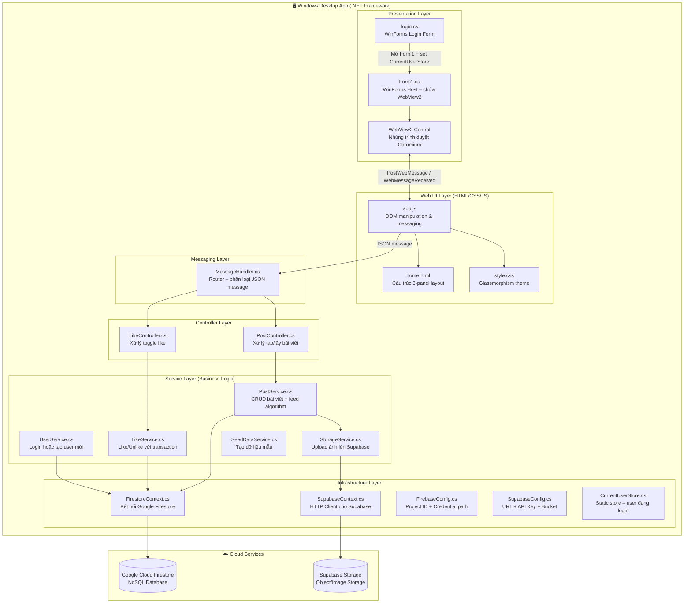
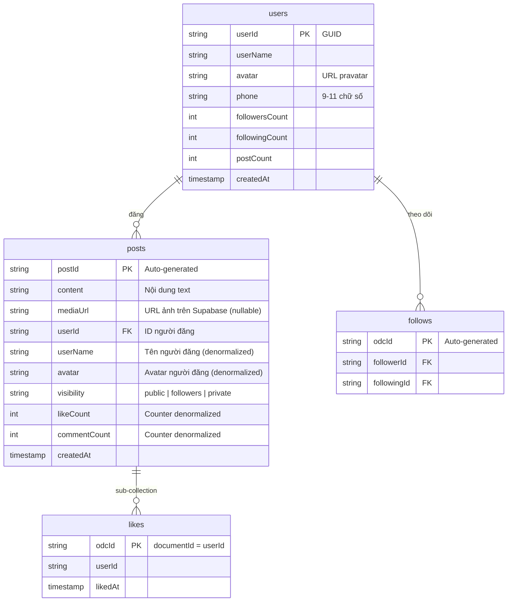
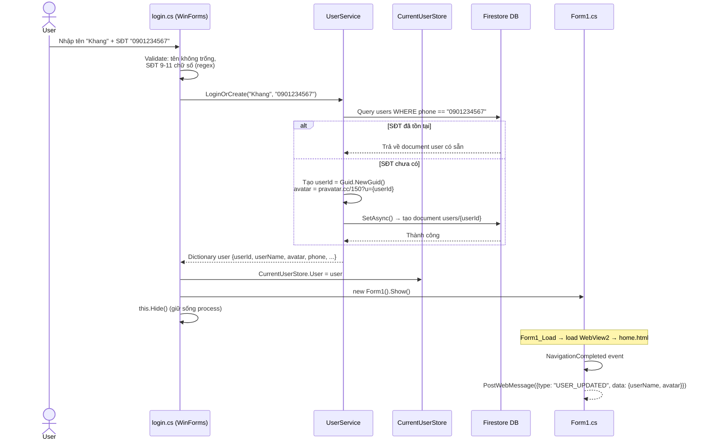
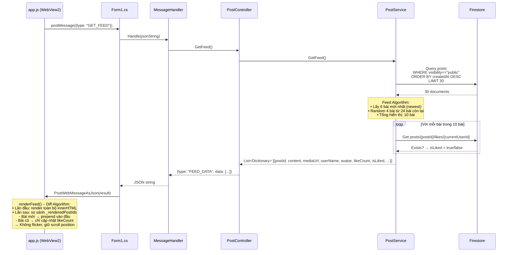
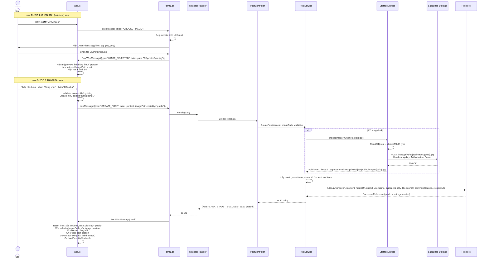
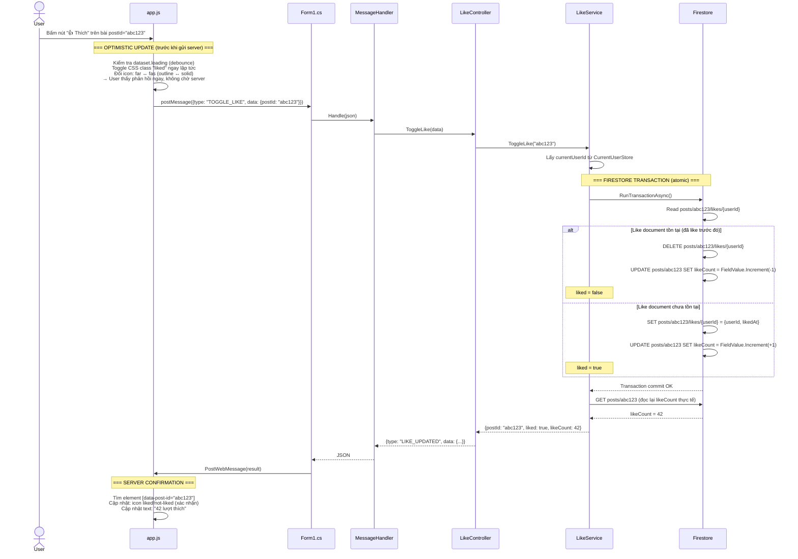
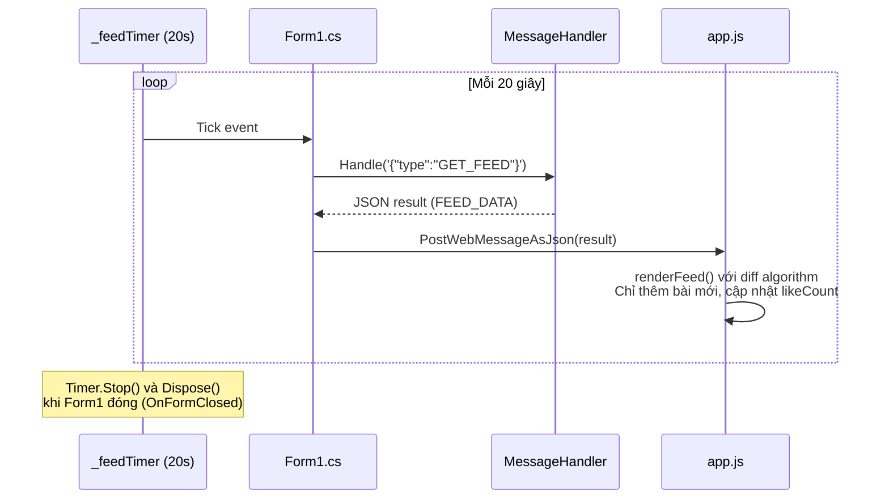
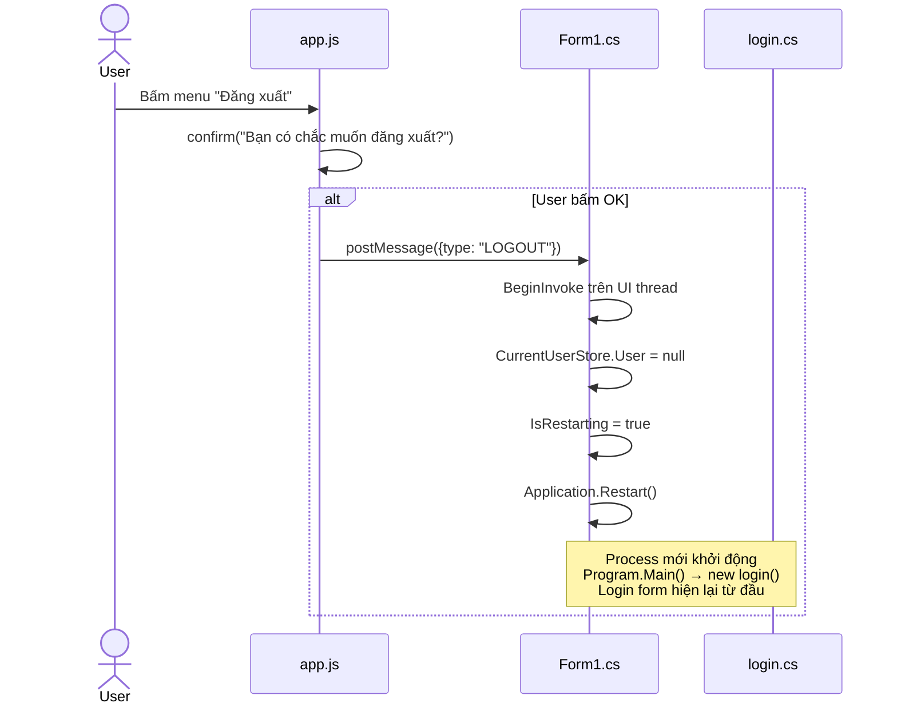

# 📋 Tổng Quan Kiến Trúc – MiniSocialApp

> Tài liệu phân tích chi tiết toàn bộ kiến trúc, luồng dữ liệu từng chức năng, cấu trúc Firestore Database, và đề xuất phát triển.

---

## 1. Tổng Quan Kiến Trúc Hệ Thống

### 1.1. Mô Hình Kiến Trúc: Hybrid WinForms + WebView2

MiniSocialApp sử dụng kiến trúc **Hybrid Desktop App**: một ứng dụng WinForms (.NET Framework) nhúng trình duyệt WebView2 để render giao diện HTML/CSS/JS hiện đại, trong khi toàn bộ logic nghiệp vụ và truy xuất dữ liệu nằm ở tầng C#.



### 1.2. Chi Tiết Từng Tầng (Layer)

#### 🔵 Tầng 1 – Entry Point & Authentication
| File | Vai trò | Chi tiết |
|------|---------|----------|
| [Program.cs](file:///c:/KHANG/trenlop/HK2%20n%C4%83m%203/NT106%20(2)%20-%20L%E1%BA%ADp%20tr%C3%ACnh%20m%E1%BA%A1ng%20c%C4%83n%20b%E1%BA%A3n/Project/MiniSocialApp/MiniSocialApp/Program.cs) | Entry point | `Application.Run(new login())` – form login là main form |
| [login.cs](file:///c:/KHANG/trenlop/HK2%20n%C4%83m%203/NT106%20(2)%20-%20L%E1%BA%ADp%20tr%C3%ACnh%20m%E1%BA%A1ng%20c%C4%83n%20b%E1%BA%A3n/Project/MiniSocialApp/MiniSocialApp/login.cs) | Login form | Nhập tên + SĐT → gọi `UserService.LoginOrCreate()` → lưu vào `CurrentUserStore.User` → mở `Form1` và ẩn login |
| [CurrentUserStore.cs](file:///c:/KHANG/trenlop/HK2%20n%C4%83m%203/NT106%20(2)%20-%20L%E1%BA%ADp%20tr%C3%ACnh%20m%E1%BA%A1ng%20c%C4%83n%20b%E1%BA%A3n/Project/MiniSocialApp/MiniSocialApp/CurrentUserStore.cs) | Global state | `static dynamic User` – lưu thông tin user hiện tại để mọi Service truy cập |

#### 🟢 Tầng 2 – Host & Bridge (WinForms ↔ WebView2)
| File | Vai trò | Chi tiết |
|------|---------|----------|
| [Form1.cs](file:///c:/KHANG/trenlop/HK2%20n%C4%83m%203/NT106%20(2)%20-%20L%E1%BA%ADp%20tr%C3%ACnh%20m%E1%BA%A1ng%20c%C4%83n%20b%E1%BA%A3n/Project/MiniSocialApp/MiniSocialApp/Form1.cs) | Host chính | Chứa WebView2, load `home.html`. Bắt `WebMessageReceived` từ JS và post kết quả về. Xử lý riêng `CHOOSE_IMAGE` (mở file dialog) và `LOGOUT` (restart app) trên UI thread |
| [Form1.Designer.cs](file:///c:/KHANG/trenlop/HK2%20n%C4%83m%203/NT106%20(2)%20-%20L%E1%BA%ADp%20tr%C3%ACnh%20m%E1%BA%A1ng%20c%C4%83n%20b%E1%BA%A3n/Project/MiniSocialApp/MiniSocialApp/Form1.Designer.cs) | UI layout | Chỉ chứa 1 control duy nhất: `WebView2` dock fill toàn form |

#### 🟡 Tầng 3 – Web UI (Frontend)
| File | Kích thước | Vai trò |
|------|-----------|---------|
| [home.html](file:///c:/KHANG/trenlop/HK2%20n%C4%83m%203/NT106%20(2)%20-%20L%E1%BA%ADp%20tr%C3%ACnh%20m%E1%BA%A1ng%20c%C4%83n%20b%E1%BA%A3n/Project/MiniSocialApp/MiniSocialApp/UI/home.html) | 383 dòng | Layout 3 cột: Sidebar trái (menu + user info), Newsfeed giữa, Sidebar phải (trending + friends + gợi ý kết bạn). Giao diện Glassmorphism |
| [style.css](file:///c:/KHANG/trenlop/HK2%20n%C4%83m%203/NT106%20(2)%20-%20L%E1%BA%ADp%20tr%C3%ACnh%20m%E1%BA%A1ng%20c%C4%83n%20b%E1%BA%A3n/Project/MiniSocialApp/MiniSocialApp/UI/style.css) | 27.7 KB | CSS với glass effect, sidebar collapse animation, skeleton loading, toast notification |
| [app.js](file:///c:/KHANG/trenlop/HK2%20n%C4%83m%203/NT106%20(2)%20-%20L%E1%BA%ADp%20tr%C3%ACnh%20m%E1%BA%A1ng%20c%C4%83n%20b%E1%BA%A3n/Project/MiniSocialApp/MiniSocialApp/UI/app.js) | 632 dòng | Toàn bộ logic frontend: render feed (diff algorithm), bind events, xử lý message 2 chiều C# ↔ JS, sidebar toggle, modal, toast |

#### 🔴 Tầng 4 – Message Handler (Router)
| File | Vai trò | Các route đã đăng ký |
|------|---------|---------------------|
| [MessageHandler.cs](file:///c:/KHANG/trenlop/HK2%20n%C4%83m%203/NT106%20(2)%20-%20L%E1%BA%ADp%20tr%C3%ACnh%20m%E1%BA%A1ng%20c%C4%83n%20b%E1%BA%A3n/Project/MiniSocialApp/MiniSocialApp/Handlers/MessageHandler.cs) | JSON Router | `CREATE_POST` → PostController, `GET_FEED` → PostController, `TOGGLE_LIKE` → LikeController. Trả `ERROR` cho type không nhận diện |

#### 🟣 Tầng 5 – Controllers
| File | Methods | Chi tiết |
|------|---------|----------|
| [PostController.cs](file:///c:/KHANG/trenlop/HK2%20n%C4%83m%203/NT106%20(2)%20-%20L%E1%BA%ADp%20tr%C3%ACnh%20m%E1%BA%A1ng%20c%C4%83n%20b%E1%BA%A3n/Project/MiniSocialApp/MiniSocialApp/Controllers/PostController.cs) | `CreatePost(data)`, `GetFeed()` | Parse `content`, `imagePath`, `visibility` từ dynamic data → gọi PostService → trả `CREATE_POST_SUCCESS` hoặc `FEED_DATA` |
| [LikeController.cs](file:///c:/KHANG/trenlop/HK2%20n%C4%83m%203/NT106%20(2)%20-%20L%E1%BA%ADp%20tr%C3%ACnh%20m%E1%BA%A1ng%20c%C4%83n%20b%E1%BA%A3n/Project/MiniSocialApp/MiniSocialApp/Controllers/LikeController.cs) | `ToggleLike(data)` | Parse `postId` → gọi LikeService → trả `LIKE_UPDATED` |

#### 🟠 Tầng 6 – Services (Business Logic)
| File | Methods | Chi tiết kỹ thuật |
|------|---------|-------------------|
| [PostService.cs](file:///c:/KHANG/trenlop/HK2%20n%C4%83m%203/NT106%20(2)%20-%20L%E1%BA%ADp%20tr%C3%ACnh%20m%E1%BA%A1ng%20c%C4%83n%20b%E1%BA%A3n/Project/MiniSocialApp/MiniSocialApp/Services/PostService.cs) | `CreatePost()`, `GetFeed()`, `GetFollowingIds()` | **CreatePost**: upload ảnh (nếu có) → build document dictionary → `AddAsync` vào collection `posts`. **GetFeed**: query 30 bài public mới nhất → lấy 6 bài mới + 4 bài cũ random → check `isLiked` cho từng bài bằng sub-collection `likes` |
| [LikeService.cs](file:///c:/KHANG/trenlop/HK2%20n%C4%83m%203/NT106%20(2)%20-%20L%E1%BA%ADp%20tr%C3%ACnh%20m%E1%BA%A1ng%20c%C4%83n%20b%E1%BA%A3n/Project/MiniSocialApp/MiniSocialApp/Services/LikeService.cs) | `ToggleLike(postId)` | Dùng **Firestore Transaction** để đảm bảo atomic: nếu like doc tồn tại → xóa + giảm count, ngược lại → tạo + tăng count. Sau đó đọc lại `likeCount` thực tế |
| [StorageService.cs](file:///c:/KHANG/trenlop/HK2%20n%C4%83m%203/NT106%20(2)%20-%20L%E1%BA%ADp%20tr%C3%ACnh%20m%E1%BA%A1ng%20c%C4%83n%20b%E1%BA%A3n/Project/MiniSocialApp/MiniSocialApp/Services/StorageService.cs) | `UploadImage(filePath)` | Đọc file thành byte array → POST lên Supabase Storage REST API với MIME type tự phát hiện → trả về public URL. Dùng `static readonly HttpClient` tránh socket exhaustion |
| [UserService.cs](file:///c:/KHANG/trenlop/HK2%20n%C4%83m%203/NT106%20(2)%20-%20L%E1%BA%ADp%20tr%C3%ACnh%20m%E1%BA%A1ng%20c%C4%83n%20b%E1%BA%A3n/Project/MiniSocialApp/MiniSocialApp/Services/UserService.cs) | `LoginOrCreate(userName, phone)` | Query Firestore collection `users` theo SĐT. Nếu tồn tại → trả về user. Nếu không → tạo mới với `userId = Guid`, avatar random từ pravatar.cc, counters = 0 |
| [SeedDataService.cs](file:///c:/KHANG/trenlop/HK2%20n%C4%83m%203/NT106%20(2)%20-%20L%E1%BA%ADp%20tr%C3%ACnh%20m%E1%BA%A1ng%20c%C4%83n%20b%E1%BA%A3n/Project/MiniSocialApp/MiniSocialApp/SeedDataService.cs) | `SeedStarterPostsForUser()` | Tạo 4-6 bài viết mẫu cho user mới bằng `WriteBatch`. Nội dung random từ 10 câu tiếng Việt, thời gian ngẫu nhiên trong 3 ngày gần. Hiện đang bị comment out trong Form1_Load |

#### ⚫ Tầng 7 – Infrastructure / Config
| File | Vai trò |
|------|---------|
| [FirestoreContext.cs](file:///c:/KHANG/trenlop/HK2%20n%C4%83m%203/NT106%20(2)%20-%20L%E1%BA%ADp%20tr%C3%ACnh%20m%E1%BA%A1ng%20c%C4%83n%20b%E1%BA%A3n/Project/MiniSocialApp/MiniSocialApp/Core/FirestoreContext.cs) | Set env var `GOOGLE_APPLICATION_CREDENTIALS` → tạo `FirestoreDb` instance |
| [SupabaseContext.cs](file:///c:/KHANG/trenlop/HK2%20n%C4%83m%203/NT106%20(2)%20-%20L%E1%BA%ADp%20tr%C3%ACnh%20m%E1%BA%A1ng%20c%C4%83n%20b%E1%BA%A3n/Project/MiniSocialApp/MiniSocialApp/Core/SupabaseContext.cs) | Tạo `HttpClient` với headers `apikey` + `Authorization` (hiện chưa được inject vào StorageService) |
| [FirebaseConfig.cs](file:///c:/KHANG/trenlop/HK2%20n%C4%83m%203/NT106%20(2)%20-%20L%E1%BA%ADp%20tr%C3%ACnh%20m%E1%BA%A1ng%20c%C4%83n%20b%E1%BA%A3n/Project/MiniSocialApp/MiniSocialApp/Config/FirebaseConfig.cs) | Project ID `mini-social-app-88bbb` + đường dẫn credential JSON tương đối từ `Application.StartupPath` |
| [SupabaseConfig.cs](file:///c:/KHANG/trenlop/HK2%20n%C4%83m%203/NT106%20(2)%20-%20L%E1%BA%ADp%20tr%C3%ACnh%20m%E1%BA%A1ng%20c%C4%83n%20b%E1%BA%A3n/Project/MiniSocialApp/MiniSocialApp/Config/SupabaseConfig.cs) | Supabase URL, API Key (anon), Bucket name `images` |

---

## 2. Cấu Trúc Cơ Sở Dữ Liệu (Firestore Schema)



> [!IMPORTANT]
> **Denormalization**: `userName` và `avatar` được copy trực tiếp vào document `post` thay vì join từ `users`. Điều này giúp đọc nhanh (1 query = đủ dữ liệu hiển thị) nhưng nếu user đổi tên/avatar thì các bài cũ vẫn hiển thị thông tin cũ.

> [!NOTE]
> **Likes** được lưu dưới dạng **sub-collection** của mỗi post: `posts/{postId}/likes/{userId}`. Document ID chính là userId → mỗi user chỉ like 1 lần, kiểm tra nhanh bằng `GetSnapshotAsync()`.

---

## 3. Luồng Dữ Liệu Chi Tiết Từng Chức Năng

### 3.1. 🔐 Luồng Đăng Nhập (Login / Register)

**Mô tả**: Người dùng nhập Tên + Số điện thoại. Nếu SĐT đã tồn tại → login. Nếu chưa → tự động tạo tài khoản mới. Không có mật khẩu (phone-based identity).



**Chi tiết kỹ thuật đáng chú ý**:
- Login form là **main form** của `Application.Run()` → nếu Close thì app thoát. Vì vậy khi login thành công chỉ `Hide()`, không `Close()`
- Khi user logout từ Form1 → `Application.Restart()` → process mới chạy lại từ đầu
- `Form1.IsRestarting` flag phân biệt: đóng Form1 do logout (restart) hay do user tắt app (close luôn login form)

---

### 3.2. 📰 Luồng Tải Bảng Tin (Load Newsfeed)

**Mô tả**: Được gọi khi (1) trang HTML load xong sau khi nhận `USER_UPDATED`, (2) mỗi 20 giây bởi `_feedTimer`, (3) sau khi đăng bài thành công.



**Chi tiết Feed Algorithm** (trong `PostService.GetFeed()`):
1. Query 30 bài public, sắp theo `createdAt` giảm dần
2. Lấy 6 bài đầu (mới nhất) – đảm bảo user luôn thấy tin mới
3. Từ 24 bài còn lại, random chọn 4 bài – tạo cảm giác "khám phá"
4. Ghép 6 + 4 = 10 bài, kiểm tra `isLiked` song song (`Task.WhenAll`)
5. Trả về danh sách hoàn chỉnh

**Chi tiết Diff Rendering** (trong `app.js > renderFeed()`):
- Duy trì `Set _renderedPostIds` lưu ID các bài đã render
- Lần render đầu (container trống / chỉ có skeleton) → inject toàn bộ innerHTML
- Các lần sau: chỉ thêm bài có ID chưa tồn tại, cập nhật `likeCount` text cho bài đã có
- Tránh xóa/tạo lại DOM → giữ scroll position, không flicker

---

### 3.3. ✍️ Luồng Đăng Bài Viết (Create Post)

**Mô tả**: User mở form đăng bài → nhập nội dung + chọn visibility + (tuỳ chọn) chọn ảnh → bấm "Đăng bài".



---

### 3.4. ❤️ Luồng Thích / Bỏ Thích Bài Viết (Toggle Like)

**Mô tả**: User bấm nút "Thích" → UI toggle ngay lập tức (optimistic update) → gửi request → server xác nhận.



**Kỹ thuật quan trọng**:
- **Optimistic UI**: JS toggle trạng thái visual ngay khi user click, không đợi server → UX mượt mà
- **Firestore Transaction**: Đảm bảo read-then-write atomic → không bị race condition khi 2 user like cùng lúc
- **FieldValue.Increment**: Firestore server-side increment → không cần đọc giá trị cũ rồi +1 (tránh lost update)
- **Debounce**: `dataset.loading` flag ngăn user spam click

---

### 3.5. 🔄 Luồng Auto-Refresh Feed (Polling)

**Mô tả**: Sau khi trang HTML load xong, Form1 khởi tạo một `System.Windows.Forms.Timer` gọi `GET_FEED` mỗi 20 giây.



---

### 3.6. 🚪 Luồng Đăng Xuất (Logout)



---

## 4. Giao Thức JSON Message (Communication Protocol)

Toàn bộ giao tiếp giữa JS ↔ C# đều qua chuỗi JSON với trường `type` để định danh loại message.

### 4.1. JS → C# (Request)
| `type` | `data` | Xử lý bởi | Mô tả |
|--------|--------|-----------|-------|
| `GET_FEED` | *(không có)* | MessageHandler → PostController | Yêu cầu lấy danh sách bài viết |
| `CREATE_POST` | `{content, imagePath, visibility}` | MessageHandler → PostController | Tạo bài viết mới |
| `TOGGLE_LIKE` | `{postId}` | MessageHandler → LikeController | Like / Unlike bài viết |
| `CHOOSE_IMAGE` | *(không có)* | Form1 trực tiếp (UI thread) | Mở hộp thoại chọn ảnh |
| `LOGOUT` | *(không có)* | Form1 trực tiếp (UI thread) | Đăng xuất |

### 4.2. C# → JS (Response / Event)
| `type` | `data` | Mô tả |
|--------|--------|-------|
| `FEED_DATA` | `[{postId, content, mediaUrl, userName, avatar, likeCount, commentCount, isLiked, createdAt, visibility}]` | Danh sách bài viết cho newsfeed |
| `CREATE_POST_SUCCESS` | `{postId}` | Đăng bài thành công |
| `LIKE_UPDATED` | `{postId, liked, likeCount}` | Kết quả toggle like |
| `IMAGE_SELECTED` | `{path}` | Đường dẫn ảnh local đã chọn |
| `USER_UPDATED` | `{userName, avatar}` | Thông tin user sau khi login |
| `ERROR` | `{message}` | Thông báo lỗi |

---

## 5. Đánh Giá Hiện Trạng – Điểm Mạnh & Điểm Yếu

### ✅ Điểm Mạnh
| # | Mô tả |
|---|-------|
| 1 | **Kiến trúc phân tầng rõ ràng**: Controller → Service → Context, dễ mở rộng và test |
| 2 | **Optimistic UI cho Like**: UX mượt mà, không delay chờ server |
| 3 | **Firestore Transaction** cho Like: đảm bảo data integrity (atomic toggle) |
| 4 | **Diff rendering** cho Feed: tránh flicker, giữ scroll position khi polling |
| 5 | **Skeleton loading**: trải nghiệm chờ chuyên nghiệp, không bị trắng màn hình |
| 6 | **Static HttpClient** trong StorageService: tránh socket exhaustion |
| 7 | **Separation of concerns**: Form1 chỉ làm bridge, không chứa business logic |

### ⚠️ Điểm Yếu / Thiếu Sót
| # | Vấn đề | File liên quan | Mức độ |
|---|--------|---------------|--------|
| 1 | **Polling 20s** thay vì realtime Firestore listener → tốn bandwidth, không instant | Form1.cs L148-165 | Trung bình |
| 2 | **Không có pagination**: query 30 bài, hiển thị 10, khi data lớn sẽ chậm | PostService.cs L60-63 | Cao |
| 3 | **Bình luận chưa hoạt động**: `commentCount` cố định = 0, nút bình luận không có handler | app.js L105-108 | Cao |
| 4 | **Sidebar phải hoàn toàn static**: friends list, trending, gợi ý kết bạn đều hardcode HTML | home.html L251-347 | Cao |
| 5 | **SupabaseContext không được inject** vào StorageService: StorageService tự tạo HttpClient riêng | StorageService.cs L13 | Thấp |
| 6 | **Denormalized userName/avatar** không đồng bộ khi user đổi thông tin | PostService.cs L40-46 | Thấp |
| 7 | **Login không có mật khẩu**: ai cũng có thể đăng nhập bằng bất kỳ SĐT | UserService.cs L17 | Trung bình |
| 8 | **`GetFollowingIds()` đã viết nhưng chưa sử dụng** trong GetFeed | PostService.cs L113-125 | Thấp |
| 9 | **SeedDataService bị comment out** trong Form1_Load | Form1.cs L47 | Thấp |
| 10 | **Nút Chia sẻ, Cảm xúc, Check-in, Search** chỉ là UI placeholder | home.html, app.js | Trung bình |

---

## 6. Đề Xuất Phát Triển – Roadmap Chi Tiết

### 🔴 Ưu Tiên Cao (Core Features – Nên làm ngay)

#### 6.1. Chức Năng Bình Luận (Comments)

**Tại sao quan trọng**: Bình luận là tính năng cốt lõi thứ 2 của mạng xã hội (sau Like). UI đã có nút sẵn nhưng chưa hoạt động.

**Thiết kế Firestore**:
```
posts/{postId}/comments/{commentId}
  ├── userId: string
  ├── userName: string
  ├── avatar: string
  ├── content: string
  └── createdAt: timestamp
```

**Các file cần tạo/sửa**:
| Hành động | File |
|-----------|------|
| Tạo mới | `Services/CommentService.cs` – CRUD bình luận, increment/decrement `commentCount` |
| Tạo mới | `Controllers/CommentController.cs` – `AddComment(data)`, `GetComments(postId)` |
| Sửa | `Handlers/MessageHandler.cs` – thêm case `ADD_COMMENT`, `GET_COMMENTS` |
| Sửa | `UI/app.js` – UI hiển thị comment section dưới mỗi bài, input nhập bình luận |
| Sửa | `UI/home.html` – template cho comment list |
| Sửa | `UI/style.css` – style cho comment section |

---

#### 6.2. Realtime Feed (Firestore Listeners thay Polling)

**Tại sao quan trọng**: Polling 20s → delay 0-20s + query thừa khi không có data mới. Firestore `Listen()` push data ngay khi có thay đổi, không tốn thêm bandwidth.

**Thay đổi**:
```csharp
// Thay vì Timer polling mỗi 20s:
_db.Collection("posts")
   .WhereEqualTo("visibility", "public")
   .OrderByDescending("createdAt")
   .Limit(30)
   .Listen(snapshot => {
       // Gửi data mới xuống JS ngay lập tức
       var posts = MapToDTO(snapshot);
       webView21.CoreWebView2.PostWebMessageAsJson(...);
   });
```

**Các file cần sửa**:
| File | Thay đổi |
|------|----------|
| `Form1.cs` | Xóa `_feedTimer`, thêm `FirestoreChangeListener` |
| `Services/PostService.cs` | Thêm method `ListenFeed(Action<List> callback)` |
| `UI/app.js` | Xóa loadFeed() thủ công, chỉ nhận data passive |

---

#### 6.3. Danh Sách Bạn Bè Động (Dynamic Friends List)

**Tại sao quan trọng**: Sidebar phải hiện đang 100% hardcode HTML. Cần kết nối với Firestore `follows` collection.

**Thiết kế**:
- Dùng collection `follows` (đã có `GetFollowingIds` trong PostService)
- Tạo `FriendService.cs` với `GetFriends(userId)`, `FollowUser(targetUserId)`, `UnfollowUser(targetUserId)`
- Frontend nhận message `FRIENDS_DATA` → render động sidebar phải

---

### 🟡 Ưu Tiên Trung Bình (UX Improvements)

#### 6.4. Infinite Scroll (Phân trang Newsfeed)

**Vấn đề hiện tại**: Mỗi lần load lấy 30 bài → chọn 10. Khi có 10,000 bài thì vẫn query 30 bài mới nhất.

**Giải pháp**:
```javascript
// app.js – Intersection Observer
const observer = new IntersectionObserver(entries => {
    if (entries[0].isIntersecting) {
        sendToCSharp({ type: "LOAD_MORE", data: { lastCreatedAt: lastTimestamp }});
    }
});
observer.observe(document.getElementById("loadMoreTrigger"));
```

```csharp
// PostService.cs – Cursor-based pagination
public async Task<List<...>> GetFeed(Timestamp? after = null)
{
    var query = _db.Collection("posts")
        .WhereEqualTo("visibility", "public")
        .OrderByDescending("createdAt")
        .Limit(10);

    if (after != null)
        query = query.StartAfter(after);

    // ...
}
```

---

#### 6.5. Push Notifications (Toast cho Like/Comment)

**Mô tả**: Khi ai đó like/comment bài viết của bạn → hiện toast notification.

**Thiết kế**:
- Khi Firestore listener phát hiện change ở `posts/{myPostId}/likes` hoặc `comments` → C# check nếu đó là bài của currentUser → push `NOTIFICATION` message xuống JS
- JS gọi `showToast()` (đã có sẵn hàm này)

---

#### 6.6. Chức Năng Tìm Kiếm (Search)

**Mô tả**: Thanh search trên top panel hiện chỉ là placeholder.

**Thiết kế**:
- JS gửi `{type: "SEARCH", data: {query: "..."}}` khi user nhập
- C# query Firestore: tìm bài theo content (text search), tìm user theo userName
- Trả kết quả `SEARCH_RESULTS` về JS để render

> [!WARNING]
> Firestore không hỗ trợ full-text search native. Các lựa chọn: (1) Client-side filter trên dữ liệu đã load, (2) Algolia/Typesense integration, (3) Firestore `whereGreaterThanOrEqualTo` cho prefix search.

---

### 🟢 Ưu Tiên Thấp (Nice-to-have)

#### 6.7. Trang Cá Nhân (Profile Page)

- Hiển thị thông tin user: avatar, tên, số bài, số follower/following
- Danh sách bài viết của riêng user đó
- Nút Follow/Unfollow (nếu xem profile người khác)

#### 6.8. Chat Messaging (Nhắn Tin Trực Tiếp)

- Nút 💬 trên friend card → mở cửa sổ chat
- Firestore collection `conversations/{convId}/messages/{msgId}`
- Realtime listener cho từng conversation

#### 6.9. Xóa / Chỉnh Sửa Bài Viết

- Nút "⋯" (post-more) trên mỗi bài → dropdown menu: Sửa, Xóa
- Chỉ hiện cho bài viết của currentUser
- `DELETE_POST`, `EDIT_POST` message types

#### 6.10. Cải Thiện Bảo Mật Login

- Thêm mật khẩu hoặc OTP xác thực SĐT
- Hash password trước khi lưu Firestore
- Hoặc tích hợp Firebase Authentication

---

## 7. Cây Thư Mục Dự Án (File Tree)

```
MiniSocialApp/
├── Config/
│   ├── FirebaseConfig.cs          ← Project ID + credential path
│   ├── SupabaseConfig.cs          ← URL + API Key + Bucket
│   └── *.json                     ← Firebase service account key
├── Core/
│   ├── FirestoreContext.cs        ← Tạo FirestoreDb instance
│   └── SupabaseContext.cs         ← Tạo HttpClient với auth headers
├── Controllers/
│   ├── PostController.cs          ← CreatePost, GetFeed
│   └── LikeController.cs         ← ToggleLike
├── Handlers/
│   └── MessageHandler.cs         ← JSON message router (switch/case)
├── Services/
│   ├── PostService.cs             ← CRUD posts + feed algorithm
│   ├── LikeService.cs             ← Toggle like với transaction
│   ├── StorageService.cs          ← Upload ảnh lên Supabase
│   └── UserService.cs             ← Login hoặc tạo user mới
├── UI/
│   ├── home.html                  ← Layout 3-panel Glassmorphism
│   ├── style.css                  ← 27KB CSS với glass effects
│   └── app.js                     ← 632 dòng JS logic frontend
├── CurrentUserStore.cs            ← Static global user state
├── SeedDataService.cs             ← Tạo bài viết mẫu (dev tool)
├── Program.cs                     ← Entry point → login form
├── login.cs / .Designer.cs        ← WinForms login (tên + SĐT)
├── Form1.cs / .Designer.cs        ← WinForms host chứa WebView2
└── protos/google/                 ← Protobuf definitions (Firestore)
```
