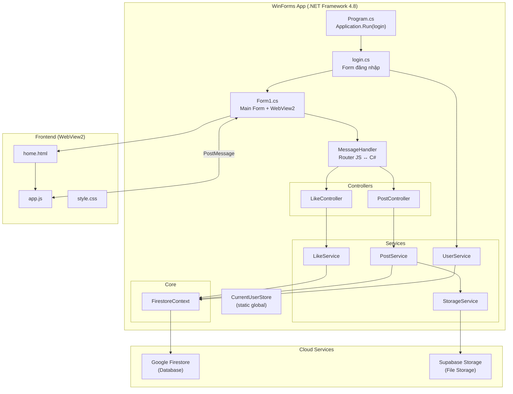
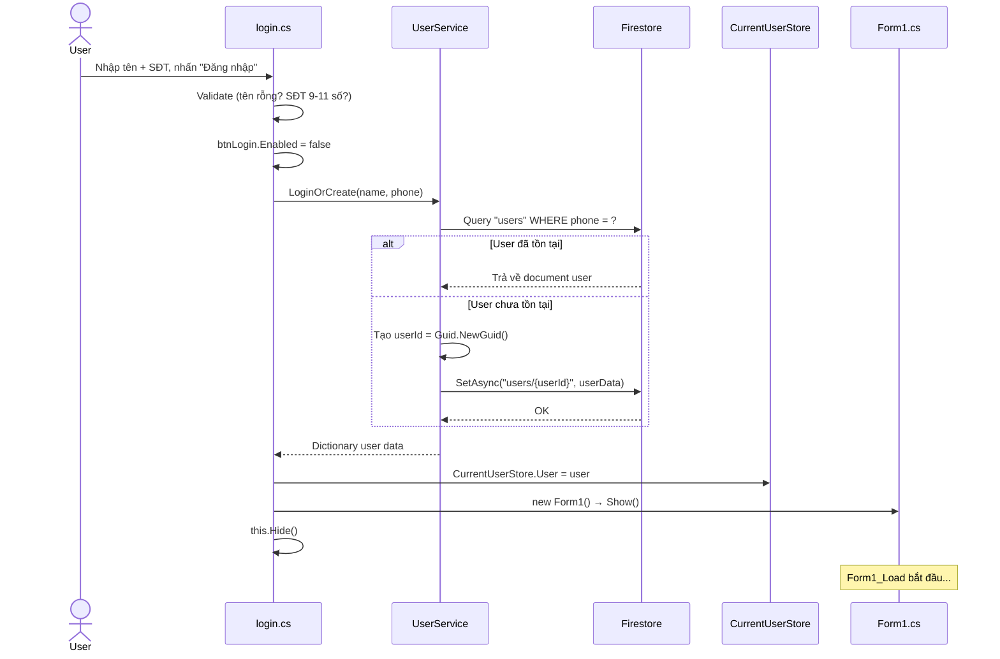
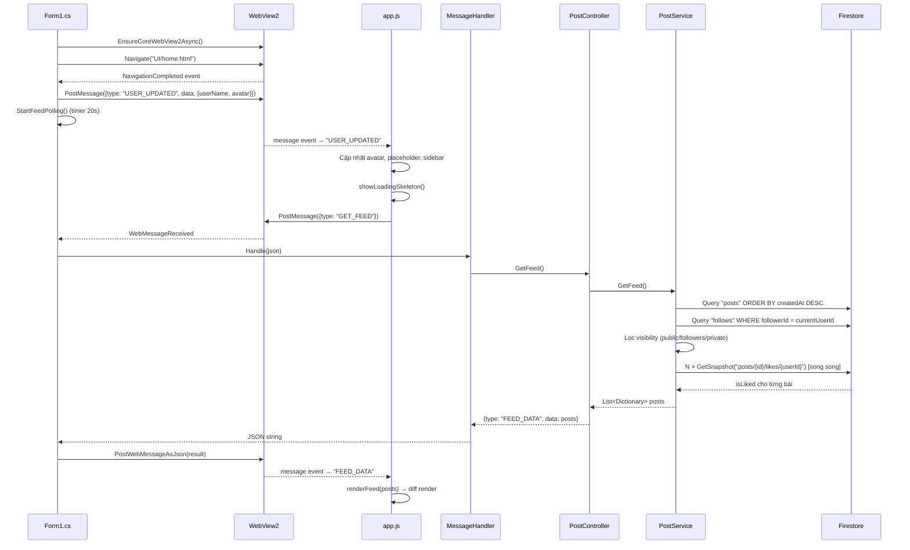
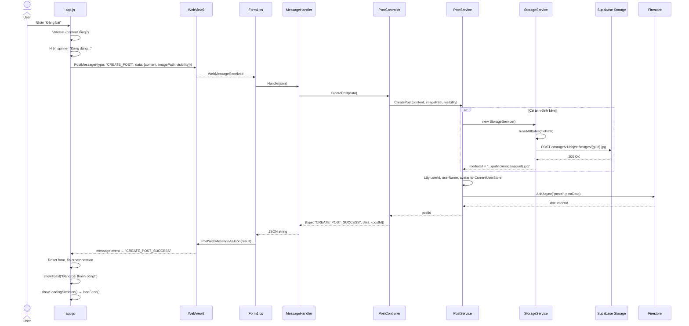
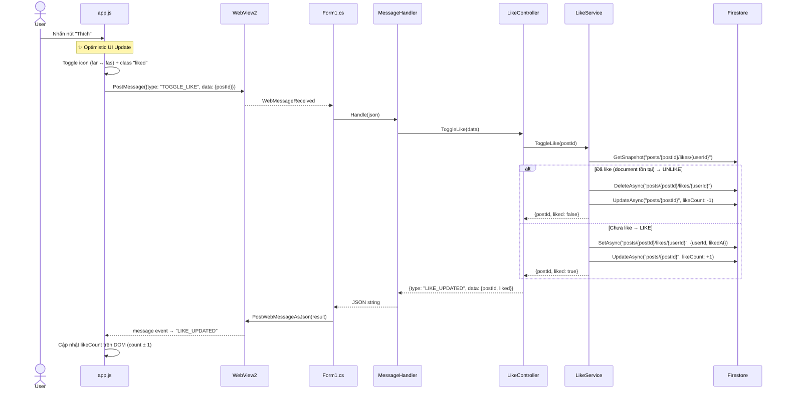
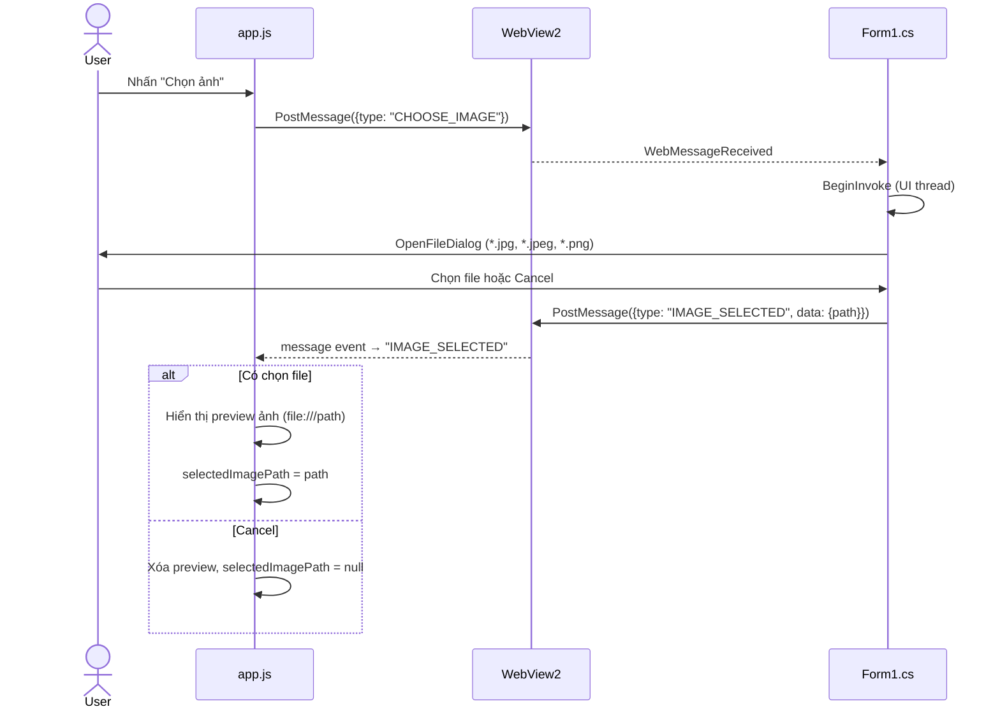
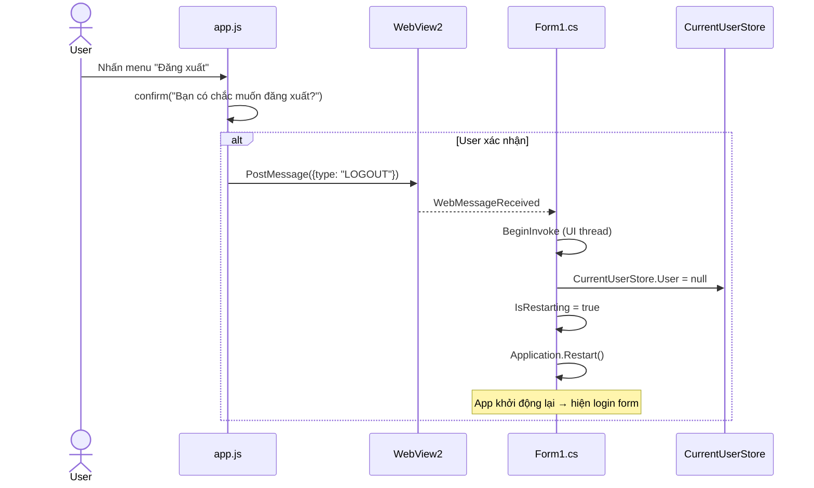
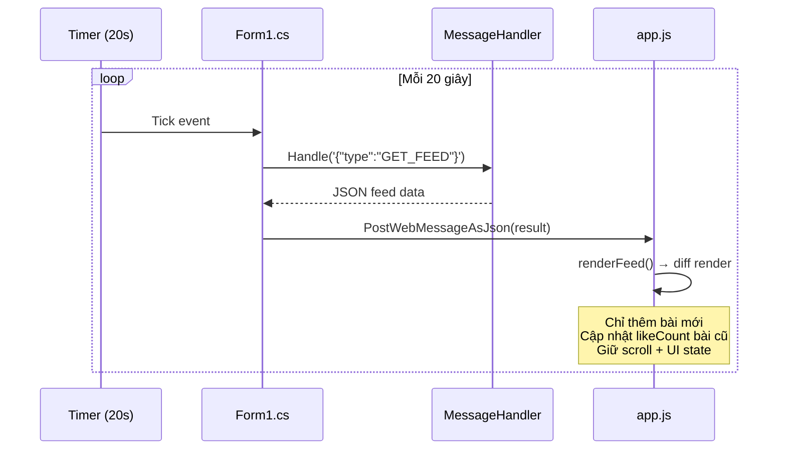
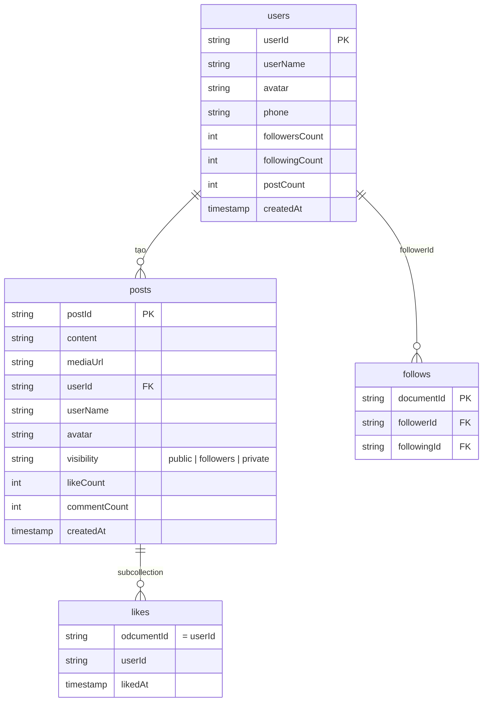

# MiniSocialApp — Kiến trúc hệ thống & Luồng hoạt động

## 1. Tổng quan kiến trúc

---

## 2. Luồng hoạt động từng chức năng

---

### 🔐 Chức năng 1: Đăng nhập / Đăng ký

**File liên quan:**
- [login.cs](file:///c:/KHANG/trenlop/HK2%20năm%203/NT106%20(2)%20-%20Lập%20trình%20mạng%20căn%20bản/Project/MiniSocialApp/MiniSocialApp/login.cs) → UI + validation
- [UserService.cs](file:///c:/KHANG/trenlop/HK2%20năm%203/NT106%20(2)%20-%20Lập%20trình%20mạng%20căn%20bản/Project/MiniSocialApp/MiniSocialApp/Services/UserService.cs) → Logic tìm/tạo user

**Firestore operations:**
- `Query("users").WhereEqualTo("phone", phone)` — 1 READ
- `SetAsync("users/{userId}", user)` — 1 WRITE (chỉ khi tạo mới)

---

### 🏠 Chức năng 2: Khởi tạo Main Form + Load Feed

**Firestore operations mỗi lần GET_FEED:**
- `Query("posts").OrderByDescending("createdAt")` — 1 READ (tất cả posts)
- `Query("follows").WhereEqualTo("followerId", userId)` — 1 READ
- `GetSnapshot("posts/{id}/likes/{userId}")` × N bài — N READs (song song)
- **Tổng: 2 + N reads** (N = số bài sau khi lọc visibility)

---

### 📝 Chức năng 3: Đăng bài viết

**API operations:**
- Supabase: `POST /storage/v1/object/images/{filename}` — 1 HTTP call (chỉ khi có ảnh)
- Firestore: `AddAsync("posts", data)` — 1 WRITE

---

### 👍 Chức năng 4: Like / Unlike bài viết

**Firestore operations:**
- `GetSnapshot("posts/{postId}/likes/{userId}")` — 1 READ
- `DeleteAsync` hoặc `SetAsync` — 1 WRITE (like doc)
- `UpdateAsync("posts/{postId}", likeCount: ±1)` — 1 WRITE
- **Tổng: 1 READ + 2 WRITEs**

---

### 🖼️ Chức năng 5: Chọn ảnh đính kèm

**API:** Không có — chỉ giao tiếp local giữa JS ↔ C#

---

### 🚪 Chức năng 6: Đăng xuất

**API:** Không có — chỉ xóa state local và restart app

---

### 🔄 Chức năng 7: Auto-refresh Feed (Polling)

---

## 3. Tổng hợp API / Dịch vụ bên ngoài

Hệ thống sử dụng **2 dịch vụ cloud** với tổng cộng **7 loại API call**:

### API 1: Google Cloud Firestore (Database NoSQL)

| # | Operation | Collection | Chức năng | Loại | Khi nào gọi |
|---|-----------|------------|-----------|------|-------------|
| 1 | `Query.WhereEqualTo` | `users` | Tìm user theo SĐT | READ | Đăng nhập |
| 2 | `SetAsync` | `users/{userId}` | Tạo user mới | WRITE | Đăng ký (lần đầu) |
| 3 | `AddAsync` | `posts` | Tạo bài viết mới | WRITE | Đăng bài |
| 4 | `Query.OrderByDescending` | `posts` | Lấy tất cả bài viết | READ | Load feed / Polling |
| 5 | `Query.WhereEqualTo` | `follows` | Lấy danh sách following | READ | Load feed (lọc visibility) |
| 6 | `GetSnapshotAsync` | `posts/{id}/likes/{userId}` | Kiểm tra user đã like? | READ | Load feed (× N bài) |
| 7 | `SetAsync` | `posts/{id}/likes/{userId}` | Thêm like | WRITE | Like bài |
| 8 | `DeleteAsync` | `posts/{id}/likes/{userId}` | Xóa like | WRITE | Unlike bài |
| 9 | `UpdateAsync` | `posts/{id}` | Cập nhật likeCount ± 1 | WRITE | Like/Unlike |

> **Thư viện:** `Google.Cloud.Firestore` v4.2.0 (NuGet)  
> **Xác thực:** Service Account JSON key (Firebase Admin SDK)  
> **Protocol:** gRPC (HTTP/2) qua `Grpc.Core`

### API 2: Supabase Storage (Object Storage)

| # | Operation | Endpoint | Chức năng | Loại | Khi nào gọi |
|---|-----------|----------|-----------|------|-------------|
| 1 | Upload file | `POST /storage/v1/object/images/{filename}` | Upload ảnh bài viết | WRITE | Đăng bài có ảnh |
| 2 | Public URL | `GET /storage/v1/object/public/images/{filename}` | Hiển thị ảnh | READ | Render feed (trình duyệt tự gọi) |

> **Thư viện:** `System.Net.Http.HttpClient` (tự gọi REST)  
> **Xác thực:** API Key qua header `apikey` + `Authorization: Bearer`  
> **Protocol:** HTTPS (REST API)  
> **Bucket:** `images`

---

## 4. Cấu trúc dữ liệu Firestore

| Collection | Đường dẫn | Mô tả |
|------------|-----------|-------|
| `users` | `/users/{userId}` | Thông tin người dùng |
| `posts` | `/posts/{postId}` | Bài viết |
| `likes` | `/posts/{postId}/likes/{userId}` | Subcollection — ai đã like bài nào |
| `follows` | `/follows/{docId}` | Quan hệ follow (followerId → followingId) |

---

## 5. Giao tiếp JS ↔ C# (WebView2 Bridge)

Toàn bộ giao tiếp qua **PostMessage** (JSON):

### JS → C# (6 message types)

| Type | Data | Xử lý bởi | Mô tả |
|------|------|------------|-------|
| `GET_FEED` | *(không có)* | `PostController.GetFeed()` | Lấy danh sách bài viết |
| `CREATE_POST` | `{content, imagePath, visibility}` | `PostController.CreatePost()` | Đăng bài mới |
| `TOGGLE_LIKE` | `{postId}` | `LikeController.ToggleLike()` | Like/Unlike |
| `CHOOSE_IMAGE` | *(không có)* | `Form1` trực tiếp | Mở dialog chọn file |
| `LOGOUT` | *(không có)* | `Form1` trực tiếp | Đăng xuất |

### C# → JS (5 message types)

| Type | Data | Mô tả |
|------|------|-------|
| `USER_UPDATED` | `{userName, avatar}` | Gửi thông tin user sau login |
| `FEED_DATA` | `[{postId, content, ...}]` | Danh sách bài viết |
| `CREATE_POST_SUCCESS` | `{postId}` | Đăng bài thành công |
| `LIKE_UPDATED` | `{postId, liked}` | Kết quả like/unlike |
| `IMAGE_SELECTED` | `{path}` | Đường dẫn ảnh đã chọn |

---

## 6. Tóm tắt số lượng API

| Dịch vụ | Số operations | Protocol | Xác thực |
|---------|---------------|----------|----------|
| **Google Firestore** | 9 loại (READ/WRITE) | gRPC (HTTP/2) | Service Account JSON |
| **Supabase Storage** | 2 loại (Upload + Public URL) | HTTPS REST | API Key + Bearer Token |
| **Tổng** | **11 loại API call** | | |
